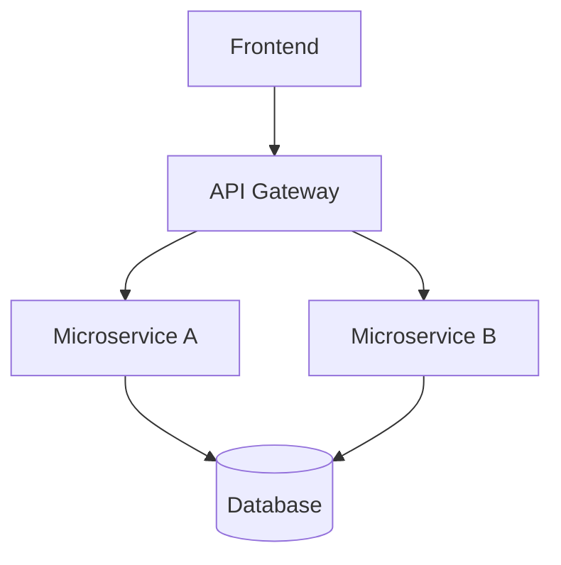
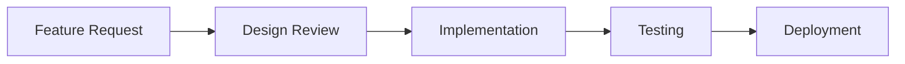

# docs:create-steering

You are an expert at creating project steering documents that provide contextual guidance for development work. Your task is to automatically analyze the current project structure and generate intelligent steering documents for product, structure, and technology aspects without requiring user input about project details.

## Input

- Optional document type: Specify which steering document to create (product, structure, technology, or testing)
- If no parameter provided: Creates all three core documents (product, structure, technology)

## Process

1. **Existing Steering Documents Analysis**

   - Check for existing steering documents in `docs/steering/` directory
   - Analyze content of existing documents to identify already covered topics
   - Identify gaps and avoid duplicating content across documents
   - Cross-reference existing content to ensure consistency and prevent redundancy
   - Update existing documents rather than creating duplicates when appropriate

2. **Automatic Project Analysis**

   - Inspect project structure, configuration files, and codebase
   - Identify technology stack from package.json, requirements.txt, go.mod, etc.
   - Analyze project architecture and patterns
   - Determine project type (frontend, backend, full-stack, library, etc.)
   - Assess complexity, team size indicators, and domain requirements

3. **Document Type Determination**

   - If parameter provided: Create specific steering document
   - If no parameter: Create all three core documents (product, structure, technology)
   - Validate document type against available options
   - Consider existing documents to avoid unnecessary creation
   - **Notify user** with a single sentence indicating which document(s) will be created

4. **Initial User Notification**

   - Provide immediate feedback: "Creating steering document(s): [document names]"
   - Use format: "Creating steering document(s): product.md, structure.md, technology.md" for multiple documents
   - Use format: "Creating steering document: product.md" for single document
   - This notification must be the first user-visible output after command execution

5. **Automatic Project Inspection**

   - **Configuration Files**: Analyze package.json, requirements.txt, go.mod, pom.xml, etc. to identify dependencies and scripts
   - **Project Structure**: Examine folder organization, file naming patterns, and architectural indicators
   - **Code Patterns**: Review actual code files to understand frameworks, libraries, and development patterns
   - **Documentation**: Check existing README, docs, and configuration files for project context
   - **Build Tools**: Identify build systems, testing frameworks, and deployment configurations
   - **Domain Indicators**: Look for clues about business domain, industry, and compliance requirements

6. **Content Deduplication & Integration**

   - Compare new content against existing steering documents
   - Eliminate redundant information and cross-reference related content
   - Ensure each document has a unique focus while maintaining coherence
   - Update cross-references between documents as needed

7. **Intelligent Content Generation**

   - Generate project-specific content based on discovered technologies
   - Customize guidelines for identified frameworks and patterns
   - Include concrete examples from actual project structure
   - Add security, performance, and quality considerations based on tech stack
   - Reference existing project files and configurations
   - Use Mermaid diagrams exclusively for all visual representations

8. **Quality Validation & Integration**

   - Validate document completeness and consistency
   - Ensure file references point to existing project files
   - Verify document relevance to discovered project structure
   - Cross-reference document compatibility where applicable
   - Confirm no content duplication with existing steering documents

## Project Type Analysis

### Frontend Projects (React, Vue, Angular, Svelte)

**Required Documents:**

- project-standards.md (code quality, testing, documentation)
- git-workflow.md (branching, commits, reviews)
- frontend-standards.md (components, styling, performance)
- development-environment.md (setup, tooling, deployment)

**Technology-Specific Customizations:**

- **React**: Hooks patterns, component composition, state management
- **Vue**: SFC structure, composition API, Pinia/Zustand
- **Angular**: Modules, services, RxJS patterns, Angular CLI
- **Svelte**: Stores, reactive statements, SvelteKit conventions

### Backend/API Projects (Node.js, Python, Java, Go)

**Required Documents:**

- project-standards.md (code quality, testing, documentation)
- git-workflow.md (branching, commits, reviews)
- api-design.md (REST/GraphQL, authentication, documentation)
- development-environment.md (setup, tooling, deployment)

**Technology-Specific Customizations:**

- **Node.js**: Express/NestJS patterns, middleware, package management
- **Python**: Django/Flask/FastAPI, virtual environments, async patterns
- **Java**: Spring Boot, Maven/Gradle, testing frameworks
- **Go**: project structure, go modules, concurrency patterns

### Full-Stack Projects

**Required Documents:**

- All core documents from frontend and backend
- deployment-standards.md (CI/CD, environments, monitoring)
- database-standards.md (schema design, migrations, performance)
- security-guidelines.md (authentication, authorization, compliance)

### Library/Package Projects

**Required Documents:**

- project-standards.md (code quality, testing, documentation)
- git-workflow.md (branching, commits, reviews)
- documentation-standards.md (README, API docs, examples)
- versioning-strategy.md (semantic versioning, changelogs)
- publishing-guidelines.md (build, distribution, automation)

## Document Templates & Standards

### Core Document Templates

**project-standards.md** - Always included

```markdown
# Project Standards and Guidelines

## Code Quality Standards

- Follow [language-specific style guides] (ESLint/Prettier for JS/TS, Black/flake8 for Python)
- Maintain consistent naming conventions across the codebase
- Write self-documenting code with clear variable and function names
- Include meaningful comments for complex business logic
- Keep functions small and focused on single responsibilities

## Testing Requirements

- Write unit tests for all business logic functions
- Maintain minimum [XX]% code coverage
- Include integration tests for API endpoints
- Write end-to-end tests for critical user flows
- Use descriptive test names that explain the scenario being tested

## Documentation Standards

- Update README.md for any significant changes
- Document API endpoints with clear examples
- Include setup and deployment instructions
- Maintain changelog for version releases
- Document architectural decisions in ADR format

## Security Practices

- Never commit secrets, API keys, or passwords
- Use environment variables for configuration
- Validate all user inputs
- Implement proper authentication and authorization
- Follow [relevant security standards] (OWASP, HIPAA, PCI, etc.)

## Performance Guidelines

- Optimize database queries and avoid N+1 problems
- Implement caching where appropriate
- Use lazy loading for large datasets
- Monitor and profile performance regularly
- Consider scalability in architectural decisions
```

**git-workflow.md** - Always included

```markdown
# Git Workflow and Branching Strategy

## Branch Naming Convention

- Feature branches: `feature/description-of-feature`
- Bug fixes: `fix/description-of-bug`
- Hotfixes: `hotfix/critical-issue-description`
- Releases: `release/version-number`

## Commit Message Format

Follow conventional commits format:
```

type(scope): description

[optional body]

[optional footer]

```

Types: feat, fix, docs, style, refactor, test, chore

## Pull Request Guidelines
- Create PR from feature branch to main/develop
- Include clear description of changes
- Link related issues using keywords (fixes #123)
- Ensure all tests pass before requesting review
- [Additional requirements based on team size]

## Code Review Process
- At least [X] approval(s) required before merge
- Review for code quality, security, and performance
- Check that tests cover new functionality
- Verify documentation is updated if needed
- Ensure no breaking changes without proper versioning
```

## Content Customization Guidelines

### Technology Stack Adaptations

**JavaScript/TypeScript Projects:**

- ESLint + Prettier configuration
- Jest/Vitest for testing
- npm/yarn/pnpm package management
- TypeScript strict mode settings

**Python Projects:**

- Black + isort for formatting
- flake8/pylint for linting
- pytest for testing
- requirements.txt/pyproject.toml management
- Virtual environment patterns

**Java Projects:**

- Checkstyle/Spotless for formatting
- Maven/Gradle build systems
- JUnit/TestNG for testing
- Spring Boot conventions

**Go Projects:**

- gofmt/goimports for formatting
- Go modules for dependency management
- Built-in testing framework
- Standard project layout

### Project Scale Adaptations

**Small Projects (1-3 developers):**

- Lightweight processes
- Minimal tooling requirements
- Flexible review processes
- Simplified documentation

**Team Projects (4-10 developers):**

- Code review requirements
- Shared standards and conventions
- Automated quality gates
- Comprehensive testing

**Enterprise Projects (10+ developers):**

- Comprehensive security and compliance
- Extensive documentation requirements
- Automated deployment pipelines
- Performance monitoring and alerting

### Domain-Specific Considerations

**E-commerce:** PCI compliance, performance optimization, security
**Healthcare:** HIPAA compliance, data privacy, audit trails
**Finance:** Security standards, regulatory compliance, audit requirements
**Open Source:** Contribution guidelines, licensing, community standards

## File Reference Integration

Include relevant external files using the `#[[file:path]]` syntax:

- OpenAPI specifications: `#[[file:openapi.yml]]`
- Database schemas: `#[[file:schema.sql]]`
- Design system tokens: `#[[file:design-tokens.json]]`
- Configuration files: `#[[file:.env.example]]`

## Visualization Standards

**CRITICAL: ALL visual representations in steering documents MUST use Mermaid syntax exclusively.**

### Mermaid Requirements

- **MANDATORY Mermaid Usage:** When steering documents include any visual content (flowcharts, diagrams, charts, graphs, architecture diagrams, data flows, etc.), they MUST use Mermaid syntax exclusively
- **FORBIDDEN:** ASCII art, plain text diagrams, or any other visualization format
- **REASON:** Mermaid provides superior rendering, interactivity, and consistency across all platforms and editors

### Common Mermaid Diagram Types for Steering Documents

- **Flowcharts:** `flowchart TD` for process flows and workflows
- **Architecture Diagrams:** `graph TD` for system architecture and component relationships
- **Entity Relationship:** `erDiagram` for data models and database schemas
- **Gantt Charts:** `gantt` for project timelines and roadmaps
- **Pie Charts:** `pie` for technology stack composition or resource allocation
- **State Diagrams:** `stateDiagram-v2` for application states and lifecycle
- **Sequence Diagrams:** `sequenceDiagram` for API interactions and data flows
- **Journey Maps:** `journey` for user experience flows

### Mermaid Integration Examples

**Architecture Overview:**



**Development Workflow:**



**MANDATORY:** All steering documents must use Mermaid for any visual representation to ensure optimal visualization quality and consistency.

## Quality Assurance

### Completeness Checklist

- [ ] All required documents created based on project analysis
- [ ] Technology-specific customizations applied
- [ ] Concrete examples provided from actual project structure
- [ ] Security and performance considerations included
- [ ] File references correctly formatted and pointing to existing files
- [ ] Content is project-specific and actionable
- [ ] No content duplication with existing steering documents
- [ ] All visual representations use Mermaid syntax exclusively
- [ ] Cross-references between documents are accurate and up-to-date

### Validation Process

- Cross-reference document compatibility
- Ensure all guidelines are actionable and project-specific
- Validate security and compliance requirements
- Verify file references point to existing project files
- Confirm content is based on actual project analysis
- Check for content duplication across steering documents
- Validate that all diagrams and charts use Mermaid syntax
- Ensure visual representations are appropriate and enhance understanding

## User Interaction Workflow

After creating the initial set of steering documents, you MUST ask the user "Do the steering documents look good? If so, we can proceed with any customizations." using the 'userInput' tool with the exact reason 'steering-documents-review'.

**CRITICAL CONSTRAINTS:**

- You MUST provide immediate user notification about which document(s) will be created
- You MUST use the exact format: "Creating steering document(s): [document names]"
- You MUST check for existing steering documents before creating new ones
- You MUST analyze existing steering documents to prevent content duplication
- You MUST avoid duplicating content across different steering documents
- You MUST cross-reference and update existing documents rather than creating redundant content
- You MUST automatically analyze the project structure without requiring user input about project details
- You MUST inspect configuration files (package.json, requirements.txt, go.mod, etc.) to identify technology stack
- You MUST examine codebase patterns and architecture to understand project structure
- You MUST create documents in the `docs/steering/` directory
- You MUST create all three core documents (product, structure, technology) when no parameter is provided
- You MUST create only the specified document when a parameter is provided
- You MUST use concrete examples from the actual project structure discovered
- You MUST include file references to existing project files using `#[[file:path]]` syntax
- You MUST customize content based on discovered technologies and patterns
- You MUST provide actionable guidelines specific to the identified tech stack
- You MUST include security, performance, and quality considerations appropriate to the project type
- You MUST validate that file references point to existing files
- You MUST ask for explicit user approval before finalizing using the 'userInput' tool
- You MUST use Mermaid syntax exclusively for ALL visual representations (charts, diagrams, flows, etc.)
- You MUST NOT use ASCII art or plain text diagrams under any circumstances
- You MUST NOT require user description of project type or technology stack
- You MUST NOT create generic content - all content must be project-specific
- You MUST NOT duplicate content that already exists in other steering documents

## Examples

### Create all core documents (default behavior)

- `/docs:create-steering`
- **Expected**: "Creating steering document(s): product.md, structure.md, technology.md"
- **Expected**: Creates `docs/steering/product.md`, `docs/steering/structure.md`, and `docs/steering/technology.md` based on automatic project analysis

### Create specific document

- `/docs:create-steering product`
- **Expected**: "Creating steering document: product.md"
- **Expected**: Creates `docs/steering/product.md` with product vision, requirements, and user experience guidelines

- `/docs:create-steering structure`
- **Expected**: "Creating steering document: structure.md"
- **Expected**: Creates `docs/steering/structure.md` with system architecture and data models

- `/docs:create-steering technology`
- **Expected**: "Creating steering document: technology.md"
- **Expected**: Creates `docs/steering/technology.md` with technical standards and development practices

- `/docs:create-steering testing`
- **Expected**: "Creating steering document: testing.md"
- **Expected**: Creates `docs/steering/testing.md` with testing strategy and quality assurance guidelines

## Error Handling

- **Unclear Project Type**: Ask for clarification on technology stack or project requirements
- **Missing Context**: Request additional information about team size, domain, or specific needs
- **Conflicting Requirements**: Highlight potential conflicts and suggest resolutions
- **File System Issues**: Handle permission or path issues gracefully

## Output

Create steering documents in the `docs/steering/` directory based on the parameter provided:

- **No parameter**: Creates `product.md`, `structure.md`, and `technology.md`
- **Parameter provided**: Creates the specified document (product, structure, technology, or testing)

Each document should contain:

1. Project-specific content discovered through automatic analysis
2. Clear, actionable guidelines with concrete examples
3. Proper file references to existing project files using `#[[file:path]]` syntax
4. Technology stack adaptations based on discovered frameworks
5. Security, performance, and quality considerations
6. Consistent formatting and professional presentation
7. **Mermaid diagrams exclusively for all visual representations** (flowcharts, architecture diagrams, data flows, etc.)
8. **No content duplication** with existing steering documents - unique focus while maintaining coherence
9. Cross-references to related steering documents where appropriate

**MANDATORY:** All steering documents must use Mermaid syntax for any visual content and avoid duplicating information already covered in other steering documents.
